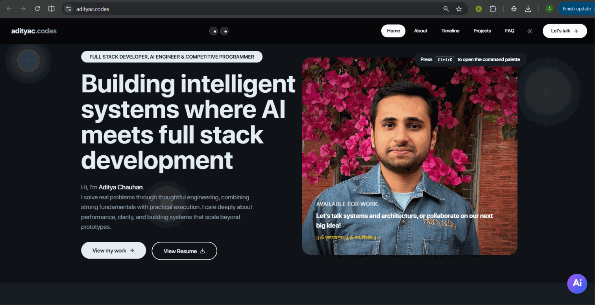
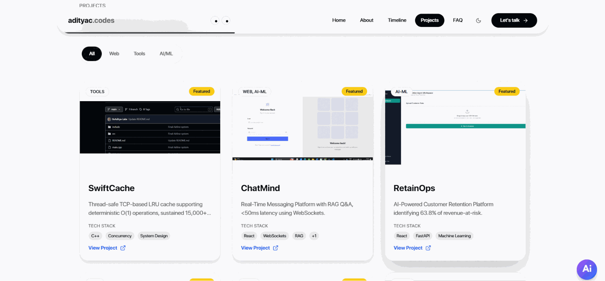
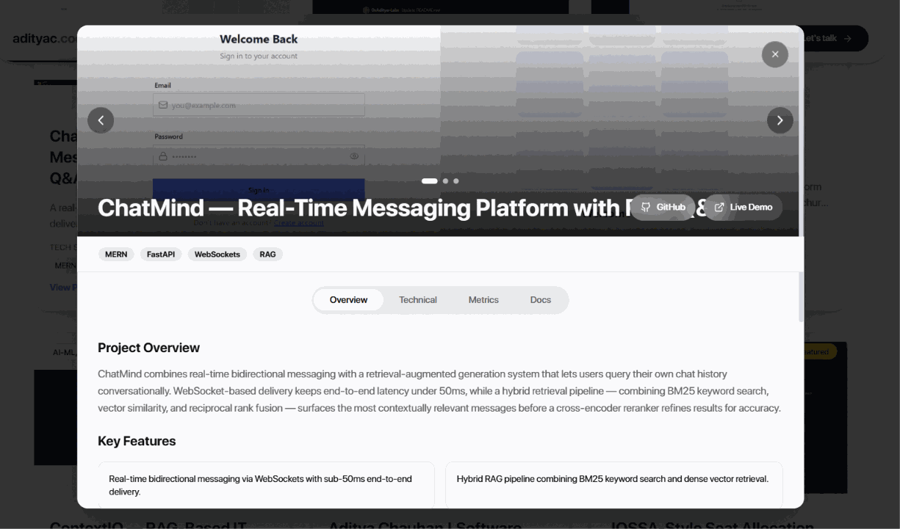
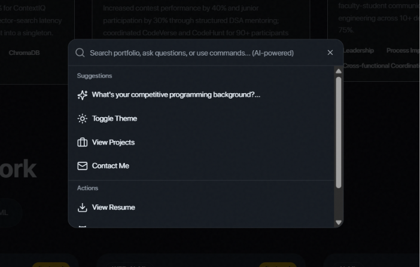
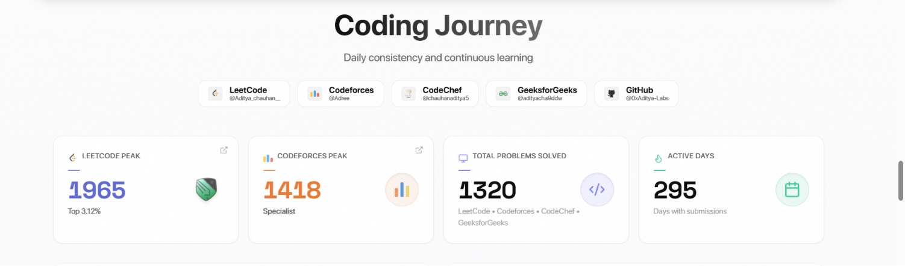
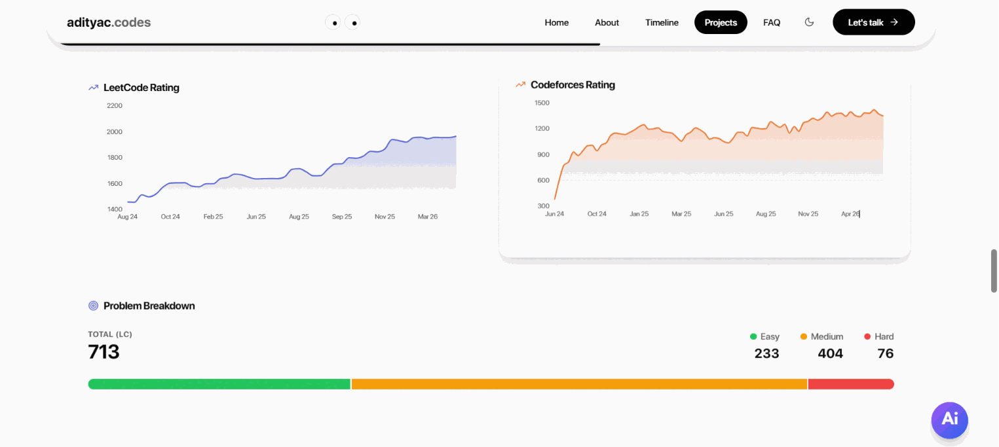
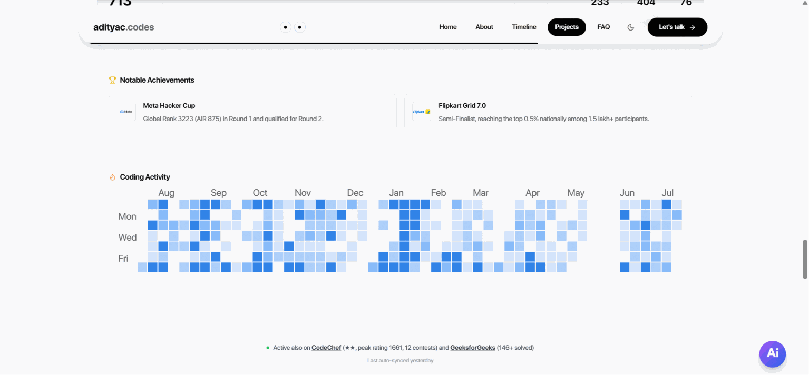
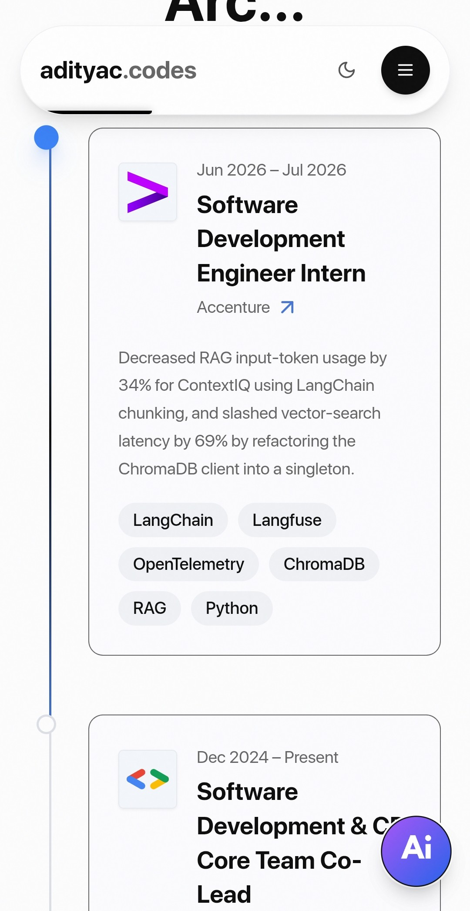

<div align="center">

# Aditya Chauhan | Software Engineer Portfolio

<a href="https://adityac.codes">

</a>

### **Building intelligent systems where AI meets high-performance engineering.**

[](https://www.typescriptlang.org/)
[](https://react.dev/)
[](https://vitejs.dev/)
[](https://tailwindcss.com/)
[](https://vercel.com/)

<br />

[🚀 Quick Start](#-quick-start) • [✨ Highlights](#-feature-highlights) • [🖼️ Screenshots](#%EF%B8%8F-screenshots) • [🛠️ Tech Stack](#%EF%B8%8F-tech-stack) • [📬 Contact](#-contact)

<br />

</div>

## 🎯 Overview

This is the personal portfolio and interactive resume of **Aditya Chauhan**—a software engineer specializing in high-performance concurrent systems, applied AI, and full-stack web development. 

Built from the ground up with **React + Vite + TypeScript**, this repository acts as a real-world product rather than a simple static page. It highlights production-grade projects (like `SwiftCache` and `ChatMind`), visualizes competitive programming statistics, and features an integrated AI assistant powered by Google Gemini.

---

## ✨ Core Features

<table>
<tr>
<td width="50%">

### 🤖 Gemini AI Command Palette
- Embedded AI search trained on Aditya's resume and background
- Keyboard-first UX (**Ctrl+K**) for instant navigation
- Graceful degradation: Hardcoded fallback logic if API limits are reached
- Fluid natural language Q&A about projects and experience

</td>
<td width="50%">

### 📊 Competitive Coding Dashboard
- Live visualization of CP statistics and milestones
- Deep links to Codeforces (Specialist), LeetCode (Knight), and CodeChef (3-star)
- Dedicated tracking of 1,200+ DSA problems solved
- Clean, accessible data charts and progress widgets

</td>
</tr>
<tr>
<td width="50%">

### 🧩 Deep Project Modals
- Rich galleries and image carousels for project screenshots
- Detailed technical breakdowns (Challenges, Solutions, Architecture)
- Deep dives into specific metrics (e.g., QPS, Latency, Accuracy)
- Direct links to GitHub repositories and live deployments

</td>
<td width="50%">

### ⚡ Performance-First Architecture
- Near-instant loads with Vite and strategic image preloading
- Scroll-triggered reveals via IntersectionObserver
- Premium Glassmorphism UI built on Radix + shadcn/ui
- Seamless Dark/Light system-aware theme switching

</td>
</tr>
</table>

---

## 🖼️ Screenshots

<table>
   <tr>
      <td align="center" width="50%">
         
         <br />
         <sub><b>Hero</b> — Clean introduction and primary CTA</sub>
      </td>
      <td align="center" width="50%">
         
         <br />
         <sub><b>Projects</b> — Filterable showcase of system and AI builds</sub>
      </td>
   </tr>
   <tr>
      <td align="center" width="50%">
         
         <br />
         <sub><b>Project Modal</b> — Technical deep-dives and metrics</sub>
      </td>
      <td align="center" width="50%">
         
         <br />
         <sub><b>Command Palette</b> — Talk to the Gemini assistant with Ctrl+K</sub>
      </td>
   </tr>
   <tr>
      <td align="center" width="50%">
         
         <br />
         <sub><b>Coding Dashboard</b> — Real-time CP stats visualization</sub>
      </td>
      <td align="center" width="50%">
         
         <br />
         <sub><b>Algorithmic Milestones</b> — Dynamic platform aggregation</sub>
      </td>
   </tr>
   <tr>
      <td align="center" width="50%">
         
         <br />
         <sub><b>Coding Activity</b> — Granular DSA tracking</sub>
      </td>
      <td align="center" width="50%">
         
         <br />
         <sub><b>Mobile Experience</b> — Fully responsive navigation</sub>
      </td>
   </tr>
</table>

---

## 🚀 Quick Start

### 1. Clone & Install
```bash
git clone https://github.com/0xAditya-Labs/My_Portfolio.git
cd My_Portfolio
npm install
```

### 2. Configure Environment
To enable the AI Command Palette, you need a free Google Gemini API key. Create a `.env` file in the root directory:
```env
VITE_GEMINI_API_KEY=your_gemini_key_here
```

### 3. Run Development Server
```bash
npm run dev
```
Open [http://localhost:8080](http://localhost:8080) to view it in the browser.

---

## 🛠️ Tech Stack

**Frontend Architecture**
- React 18, TypeScript, Vite
- Tailwind CSS

**UI / UX**
- shadcn/ui + Radix UI primitives
- framer-motion (Animations)
- lucide-react (Icons)
- next-themes (System-aware Dark Mode)

**Data & AI**
- Google Gemini API (`generativelanguage.googleapis.com/v1beta`)
- Custom Fallback Search Algorithm (Graceful Degradation)

**Deployment & Analytics**
- Vercel (Hosting)
- Vercel Analytics + Speed Insights

---

## 📬 Contact

**Aditya Chauhan**
- **Live Portfolio:** [adityac.codes](https://adityac.codes)
- **LinkedIn:** [aditya-chauhan-nitj](https://www.linkedin.com/in/aditya-chauhan-nitj/)
- **GitHub:** [@0xAditya-Labs](https://github.com/0xAditya-Labs)
- **Email:** aditya.chauhan.nitj.ac@gmail.com
- **LeetCode:** [Aditya_chauhan__](https://leetcode.com/u/Aditya_chauhan__/)

<br/>
<div align="center">

**⭐ If you enjoyed exploring this architecture or found it inspiring, consider dropping a star on the repo!**

</div>
